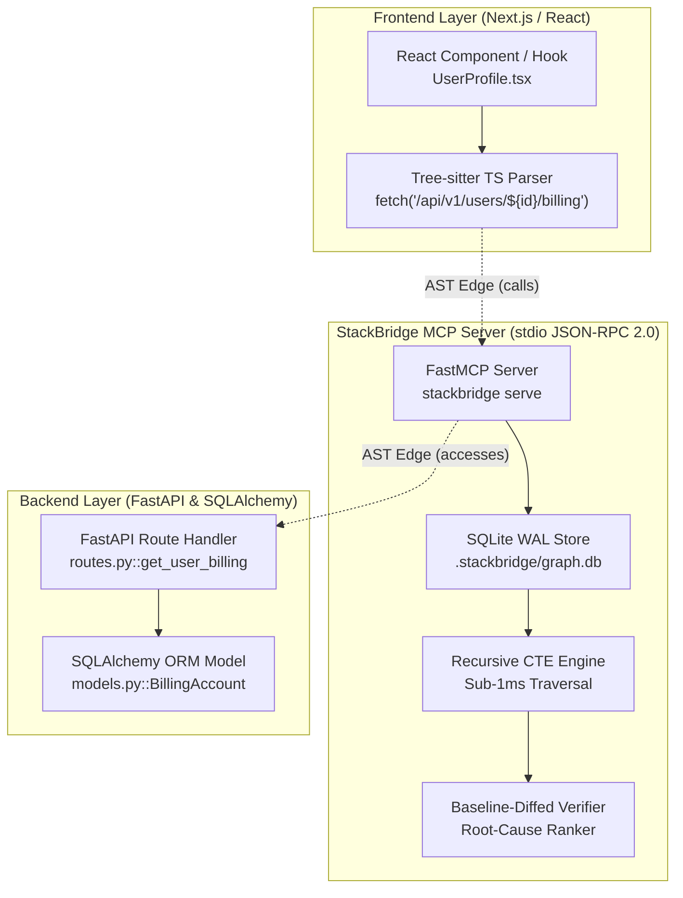

# StackBridge-MCP Architecture

StackBridge-MCP bridges the context gap between frontend client calls, backend API routes, and database ORM models for AI coding agents.

---

## 1. Subsystem Breakdown

### 🌲 1. Tree-sitter AST Parsing Engine (`stackbridge/parsers/`)
- **TypeScript/TSX Parser (`ts_fetch_parser.py`)**: Parses TSX files to discover `fetch()`, `axios.get/post()`, and `useQuery()` calls, extracting raw URLs, normalized route templates, HTTP methods, and query/path parameter mappings.
- **Python Route Parser (`py_route_parser.py`)**: Uses Python Tree-sitter grammar to extract FastAPI decorators (`@app.get`, `@router.post`), route path expressions, parameter schemas, and response models. Supports multi-file prefix resolution (`app.include_router(prefix=...)`).
- **SQLAlchemy Model Parser (`sqlalchemy_parser.py`)**: Extracts ORM class declarations, `Column` definitions, types, default values, and `relationship()` declarations.

### 🗄️ 2. High-Performance SQLite Graph Store (`stackbridge/core/sqlite_store.py`)
- Maintains a persistent local SQLite database in WAL (Write-Ahead Logging) mode at `.stackbridge/graph.db`.
- Executes bidirectional blast-radius queries via **Recursive Common Table Expressions (CTEs)** in **sub-1ms** (`0.75 ms` on real production repositories).
- Provides instant incremental graph queries without re-parsing entire codebases.

### 🛡️ 3. Baseline-Diffed Compiler Verifier (`stackbridge/verifier/`)
- **Engine (`engine.py`)**: Coordinates blast-radius discovery and applies in-memory file changes without writing to disk.
- **Root-Cause Ranking (`agent_formatter.py`)**: Uses BFS graph distance from modified files to label the primary root cause (`🔴 PRIMARY ROOT CAUSE`) and isolate downstream noise (`⚠️ CASCADING BREAKAGE`).
- **Patch Generator**: Automatically crafts minimal Git diff patches suggesting immediate fixes for coding agents.
- **Test Impact Selector**: Discovers and maps test files covering the modified route/model, flagging paths with 0% verified test coverage.

### 🤖 4. FastMCP Server (`stackbridge/mcp_server/`)
- Implements standard MCP (Model Context Protocol) JSON-RPC 2.0 over `stdio`.
- Exposes tools to AI assistants (Cursor, Claude Code, Windsurf, Antigravity) to query dependencies and verify changes before saving.
